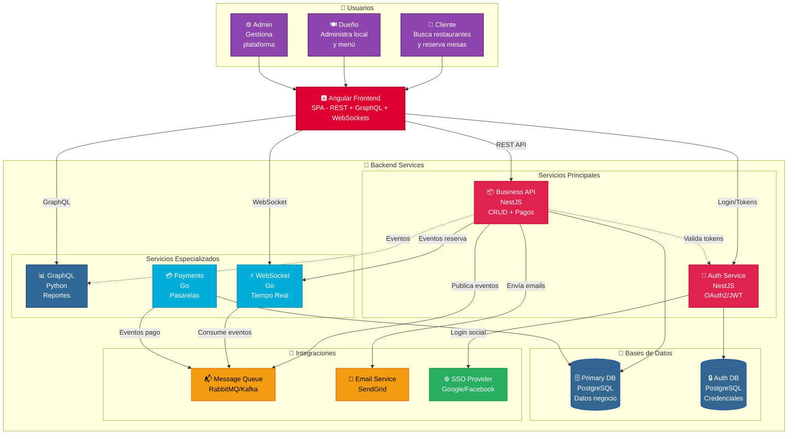

# Modelo c4 para APIs REST

```mermaid
flowchart TB
    subgraph USERS ["👥 Usuarios"]
        U1[👤 Cliente<br/>Busca restaurantes<br/>y reserva mesas]
        U2[🍽️ Dueño<br/>Administra local<br/>y menú]
        U3[⚙️ Admin<br/>Gestiona<br/>plataforma]
    end

    UI[🅰️ Angular Frontend<br/>SPA - REST + GraphQL + WebSockets]

    subgraph BACKEND ["🔧 Backend Services"]
        direction TB

        subgraph CORE ["Servicios Principales"]
            API[📦 Business API<br/>NestJS<br/>CRUD + Pagos]
            AUTH[🔐 Auth Service<br/>NestJS<br/>OAuth2/JWT]
        end

        subgraph SPECIAL ["Servicios Especializados"]
            GQL[📊 GraphQL<br/>Python<br/>Reportes]
            WS[⚡ WebSocket<br/>Go<br/>Tiempo Real]
            PAY[💳 Payments<br/>Go<br/>Pasarelas]
        end

        subgraph DATA ["💾 Bases de Datos"]
            DB[(🗄️ Primary DB<br/>PostgreSQL<br/>Datos negocio)]
            AUTHDB[(🔒 Auth DB<br/>PostgreSQL<br/>Credenciales)]
        end

        subgraph INTEGRATION ["🔌 Integraciones"]
            QUEUE[📬 Message Queue<br/>RabbitMQ/Kafka]
            MAIL[📧 Email Service<br/>SendGrid]
            SSO[🌐 SSO Provider<br/>Google/Facebook]
        end
    end

    %% Conexiones Usuarios - UI
    U1 & U2 & U3 --> UI

    %% Conexiones UI - Services
    UI -->|Login/Tokens| AUTH
    UI -->|REST API| API
    UI -->|GraphQL| GQL
    UI -->|WebSocket| WS

    %% Conexiones Services - Databases
    AUTH --> AUTHDB
    API --> DB
    PAY --> DB

    %% Conexiones entre Services
    API -.->|Valida tokens| AUTH
    API -.->|Eventos| GQL
    API -->|Eventos reserva| WS
    API -->|Publica eventos| QUEUE

    %% Conexiones WebSocket y Payments
    WS -->|Consume eventos| QUEUE
    PAY -->|Eventos pago| QUEUE

    %% Integraciones externas
    API -->|Envía emails| MAIL
    AUTH -->|Login social| SSO

    %% Estilos
    classDef userStyle fill:#8e44ad,stroke:#6c3483,stroke-width:2px,color:#fff
    classDef uiStyle fill:#dd0031,stroke:#b8002b,stroke-width:3px,color:#fff
    classDef nestStyle fill:#e0234e,stroke:#c01d42,stroke-width:2px,color:#fff
    classDef pythonStyle fill:#306998,stroke:#254b7a,stroke-width:2px,color:#fff
    classDef goStyle fill:#00add8,stroke:#0095b8,stroke-width:2px,color:#fff
    classDef dbStyle fill:#336791,stroke:#2d5aa0,stroke-width:2px,color:#fff
    classDef integrationStyle fill:#f39c12,stroke:#e67e22,stroke-width:2px,color:#000
    classDef externalStyle fill:#27ae60,stroke:#229954,stroke-width:2px,color:#fff

    class U1,U2,U3 userStyle
    class UI uiStyle
    class API,AUTH nestStyle
    class GQL pythonStyle
    class WS,PAY goStyle
    class DB,AUTHDB dbStyle
    class QUEUE,MAIL integrationStyle
    class SSO externalStyle


```
