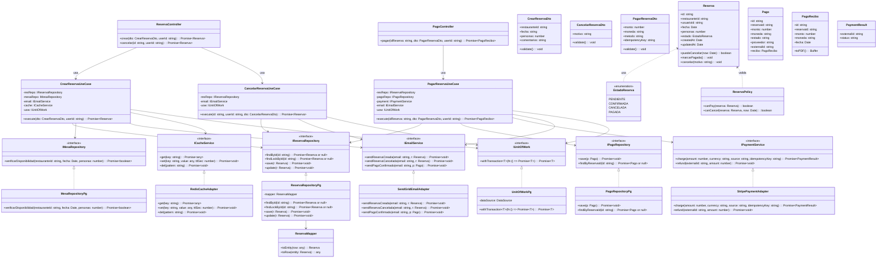

# Modelo c4 componente reservas y pagos REST

```mermaid
classDiagram
%% ================= Interface (NestJS) =================
class ReservaController {
  +crear(dto: CrearReservaDto, userId: string): Promise~Reserva~
  +cancelar(id: string, userId: string): Promise~Reserva~
}

class PagoController {
  +pagar(idReserva: string, dto: PagarReservaDto, userId: string): Promise~PagoRecibo~
}

class CrearReservaDto {
  +restauranteId: string
  +fecha: string
  +personas: number
  +comentarios: string
  +validate(): void
}

class CancelarReservaDto {
  +motivo: string
  +validate(): void
}

class PagarReservaDto {
  +monto: number
  +moneda: string
  +metodo: string
  +idempotencyKey: string
  +validate(): void
}

%% ================= Application (Use Cases) =================
class CrearReservaUseCase {
  -resRepo: IReservaRepository
  -mesaRepo: IMesaRepository
  -email: IEmailService
  -cache: ICacheService
  -uow: IUnitOfWork
  +execute(dto: CrearReservaDto, userId: string): Promise~Reserva~
}

class CancelarReservaUseCase {
  -resRepo: IReservaRepository
  -email: IEmailService
  -uow: IUnitOfWork
  +execute(id: string, userId: string, dto: CancelarReservaDto): Promise~Reserva~
}

class PagarReservaUseCase {
  -resRepo: IReservaRepository
  -pagoRepo: IPagoRepository
  -payment: IPaymentService
  -email: IEmailService
  -uow: IUnitOfWork
  +execute(idReserva: string, dto: PagarReservaDto, userId: string): Promise~PagoRecibo~
}

%% ================= Domain (Entities + Rules) =================
class Reserva {
  +id: string
  +restauranteId: string
  +usuarioId: string
  +fecha: Date
  +personas: number
  +estado: EstadoReserva
  +createdAt: Date
  +updatedAt: Date
  +puedeCancelar(now: Date): boolean
  +marcarPagada(): void
  +cancelar(motivo: string): void
}

class Pago {
  +id: string
  +reservaId: string
  +monto: number
  +moneda: string
  +estado: string
  +proveedor: string
  +externalId: string
  +recibo: PagoRecibo
}

class PagoRecibo {
  +id: string
  +reservaId: string
  +monto: number
  +moneda: string
  +fecha: Date
  +toPDF(): Buffer
}

class EstadoReserva {
  <<enumeration>>
  PENDIENTE
  CONFIRMADA
  CANCELADA
  PAGADA
}

class ReservaPolicy {
  +canPay(reserva: Reserva): boolean
  +canCancel(reserva: Reserva, now: Date): boolean
}

%% ================= Ports (Interfaces) =================
class IReservaRepository {
  <<interface>>
  +findById(id: string): Promise~Reserva or null~
  +findLockById(id: string): Promise~Reserva or null~
  +save(r: Reserva): Promise~void~
  +update(r: Reserva): Promise~void~
}

class IMesaRepository {
  <<interface>>
  +verificarDisponibilidad(restauranteId: string, fecha: Date, personas: number): Promise~boolean~
}

class IPagoRepository {
  <<interface>>
  +save(p: Pago): Promise~void~
  +findByReservaId(id: string): Promise~Pago or null~
}

class PaymentResult {
  +externalId: string
  +status: string
}

class IPaymentService {
  <<interface>>
  +charge(amount: number, currency: string, source: string, idempotencyKey: string): Promise~PaymentResult~
  +refund(externalId: string, amount: number): Promise~void~
}

class IEmailService {
  <<interface>>
  +sendReservaCreada(email: string, r: Reserva): Promise~void~
  +sendReservaCancelada(email: string, r: Reserva): Promise~void~
  +sendPagoConfirmado(email: string, p: Pago): Promise~void~
}

class ICacheService {
  <<interface>>
  +get(key: string): Promise~any~
  +set(key: string, value: any, ttlSec: number): Promise~void~
  +del(pattern: string): Promise~void~
}

class IUnitOfWork {
  <<interface>>
  +withTransaction~T~(fn: () => Promise~T~): Promise~T~
}

%% ================= Infrastructure (Adapters) =================
class ReservaRepositoryPg {
  +findById(id: string): Promise~Reserva or null~
  +findLockById(id: string): Promise~Reserva or null~
  +save(r: Reserva): Promise~void~
  +update(r: Reserva): Promise~void~
  -mapper: ReservaMapper
}

class MesaRepositoryPg {
  +verificarDisponibilidad(restauranteId: string, fecha: Date, personas: number): Promise~boolean~
}

class PagoRepositoryPg {
  +save(p: Pago): Promise~void~
  +findByReservaId(id: string): Promise~Pago or null~
}

class StripePaymentAdapter {
  +charge(amount: number, currency: string, source: string, idempotencyKey: string): Promise~PaymentResult~
  +refund(externalId: string, amount: number): Promise~void~
}

class SendGridEmailAdapter {
  +sendReservaCreada(email: string, r: Reserva): Promise~void~
  +sendReservaCancelada(email: string, r: Reserva): Promise~void~
  +sendPagoConfirmado(email: string, p: Pago): Promise~void~
}

class RedisCacheAdapter {
  +get(key: string): Promise~any~
  +set(key: string, value: any, ttlSec: number): Promise~void~
  +del(pattern: string): Promise~void~
}

class UnitOfWorkPg {
  +withTransaction~T~(fn: () => Promise~T~): Promise~T~
  -dataSource: DataSource
}

class ReservaMapper {
  +toEntity(row: any): Reserva
  +toRow(entity: Reserva): any
}

%% ================== Relationships ==================
ReservaController --> CrearReservaUseCase : usa
ReservaController --> CancelarReservaUseCase : usa
PagoController --> PagarReservaUseCase : usa

CrearReservaUseCase --> IReservaRepository
CrearReservaUseCase --> IMesaRepository
CrearReservaUseCase --> IEmailService
CrearReservaUseCase --> ICacheService
CrearReservaUseCase --> IUnitOfWork
CancelarReservaUseCase --> IReservaRepository
CancelarReservaUseCase --> IEmailService
CancelarReservaUseCase --> IUnitOfWork
PagarReservaUseCase --> IReservaRepository
PagarReservaUseCase --> IPagoRepository
PagarReservaUseCase --> IPaymentService
PagarReservaUseCase --> IEmailService
PagarReservaUseCase --> IUnitOfWork

Reserva <.. EstadoReserva : usa
Reserva <.. ReservaPolicy : valida

IReservaRepository <|.. ReservaRepositoryPg
IMesaRepository <|.. MesaRepositoryPg
IPagoRepository <|.. PagoRepositoryPg
IPaymentService <|.. StripePaymentAdapter
IEmailService <|.. SendGridEmailAdapter
ICacheService <|.. RedisCacheAdapter
IUnitOfWork <|.. UnitOfWorkPg

ReservaRepositoryPg --> ReservaMapper


```
