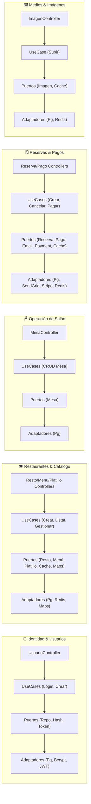

# Modelo c4 panoramico REST

```mermaid
flowchart LR
  %% Bundles (solo la “columna vertebral”)
  subgraph Identidad["🧩 Identidad & Usuarios"]
    I_C["UsuarioController"] --> I_UC["UseCases (Login, Crear)"] --> I_P["Puertos (Repo, Hash, Token)"] --> I_A["Adaptadores (Pg, Bcrypt, JWT)"]
  end
  subgraph Catalogo["🍽️ Restaurantes & Catálogo"]
    R_C["Resto/Menu/Platillo Controllers"] --> R_UC["UseCases (Crear, Listar, Gestionar)"] --> R_P["Puertos (Resto, Menú, Platillo, Cache, Maps)"] --> R_A["Adaptadores (Pg, Redis, Maps)"]
  end
  subgraph Salon["🪑 Operación de Salón"]
    S_C["MesaController"] --> S_UC["UseCases (CRUD Mesa)"] --> S_P["Puertos (Mesa)"] --> S_A["Adaptadores (Pg)"]
  end
  subgraph Reservas["🗓️ Reservas & Pagos"]
    B_C["Reserva/Pago Controllers"] --> B_UC["UseCases (Crear, Cancelar, Pagar)"] --> B_P["Puertos (Reserva, Pago, Email, Payment, Cache)"] --> B_A["Adaptadores (Pg, SendGrid, Stripe, Redis)"]
  end
  subgraph Media["🖼️ Medios & Imágenes"]
    M_C["ImagenController"] --> M_UC["UseCase (Subir)"] --> M_P["Puertos (Imagen, Cache)"] --> M_A["Adaptadores (Pg, Redis)"]
  end


```
