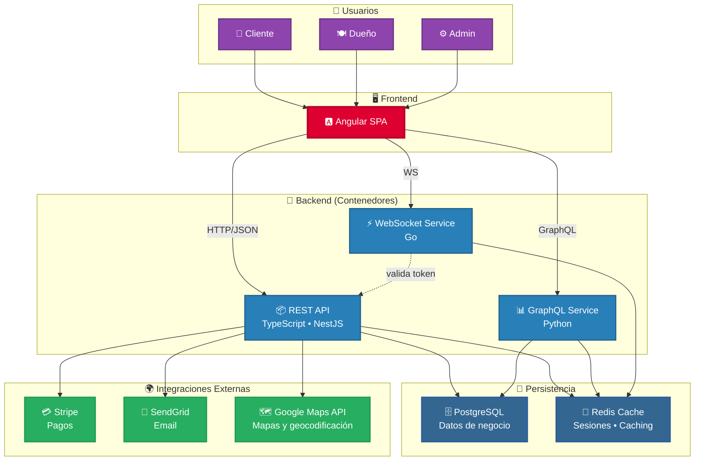

# Modelo c4 de contenedor

```mermaid
flowchart TB
    %% Actores
    subgraph USERS ["👥 Usuarios"]
        U1["👤 Cliente"]
        U2["🍽️ Dueño"]
        U3["⚙️ Admin"]
    end

    %% Frontend
    subgraph FE ["🖥️ Frontend"]
        SPA["🅰️ Angular SPA"]
    end

    %% Backend (contenedores)
    subgraph BE ["🔧 Backend (Contenedores)"]
        REST["📦 REST API<br/>TypeScript • NestJS"]
        GQL["📊 GraphQL Service<br/>Python"]
        WS["⚡ WebSocket Service<br/>Go"]
    end

    %% Persistencia / Cache
    subgraph DATA ["💾 Persistencia"]
        PG["🗄️ PostgreSQL<br/>Datos de negocio"]
        REDIS["🧠 Redis Cache<br/>Sesiones • Caching"]
    end

    %% Integraciones externas
    subgraph EXT ["🌍 Integraciones Externas"]
        STRIPE["💳 Stripe<br/>Pagos"]
        SENDGRID["📧 SendGrid<br/>Email"]
        GMAPS["🗺️ Google Maps API<br/>Mapas y geocodificación"]
    end

    %% Usuarios -> Frontend
    U1 --> SPA
    U2 --> SPA
    U3 --> SPA

    %% Frontend -> Backend
    SPA -->|HTTP/JSON| REST
    SPA -->|GraphQL| GQL
    SPA -->|WS| WS

    %% Backend -> Datos
    REST --> PG
    REST --> REDIS
    GQL --> PG
    GQL --> REDIS
    WS --> REDIS

    %% Relaciones internas útiles
    WS -.->|valida token| REST

    %% Integraciones
    REST --> STRIPE
    REST --> SENDGRID
    REST --> GMAPS

    %% Estilos
    classDef userStyle fill:#8e44ad,stroke:#6c3483,stroke-width:2px,color:#fff
    classDef feStyle fill:#dd0031,stroke:#b8002b,stroke-width:3px,color:#fff
    classDef beStyle fill:#2980b9,stroke:#1f618d,stroke-width:2px,color:#fff
    classDef dataStyle fill:#336791,stroke:#2d5aa0,stroke-width:2px,color:#fff
    classDef extStyle fill:#27ae60,stroke:#229954,stroke-width:2px,color:#fff

    class U1,U2,U3 userStyle
    class SPA feStyle
    class REST,GQL,WS beStyle
    class PG,REDIS dataStyle
    class STRIPE,SENDGRID,GMAPS extStyle

```
