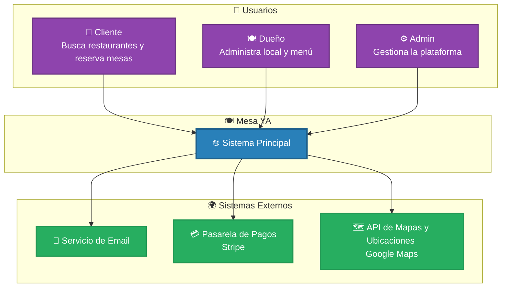

# Modelo c4 de contexto

```mermaid
flowchart TB
    subgraph USERS ["👥 Usuarios"]
        U1["👤 Cliente<br/>Busca restaurantes y reserva mesas"]
        U2["🍽️ Dueño<br/>Administra local y menú"]
        U3["⚙️ Admin<br/>Gestiona la plataforma"]
    end

    subgraph SYSTEM ["🍽️ Mesa YA"]
        SYS["🌐 Sistema Principal"]
    end

    subgraph EXTERNALS ["🌍 Sistemas Externos"]
        MAIL["📧 Servicio de Email"]
        PAY["💳 Pasarela de Pagos<br/>Stripe"]
        MAPS["🗺️ API de Mapas y Ubicaciones <br/>Google Maps"]

    end

    %% Conexiones Usuarios
    U1 --> SYS
    U2 --> SYS
    U3 --> SYS

    %% Conexiones externas
    SYS --> MAIL
    SYS --> PAY
    SYS --> MAPS

    %% Estilos
    classDef userStyle fill:#8e44ad,stroke:#6c3483,stroke-width:2px,color:#fff
    classDef systemStyle fill:#2980b9,stroke:#1f618d,stroke-width:3px,color:#fff
    classDef externalStyle fill:#27ae60,stroke:#229954,stroke-width:2px,color:#fff

    class U1,U2,U3 userStyle
    class SYS systemStyle
    class MAIL,PAY,MAPS externalStyle

```
