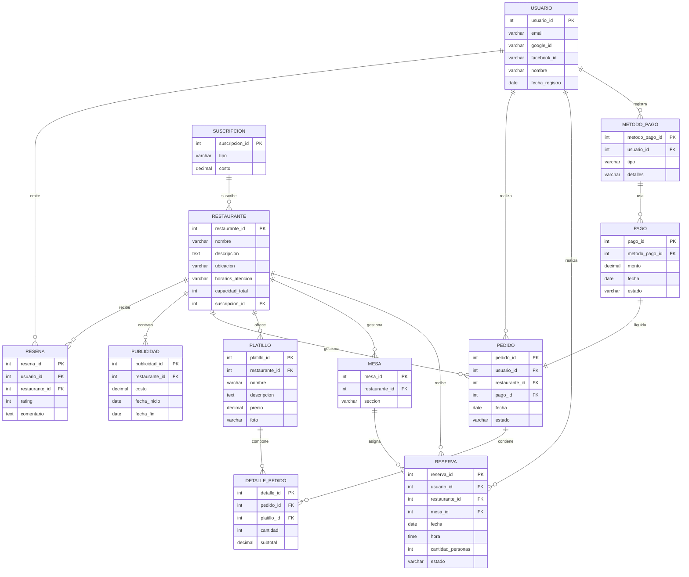

# Diagrama de casos de uso

```mermaid
erDiagram
    USUARIO {
        int usuario_id PK
        varchar email
        varchar google_id
        varchar facebook_id
        varchar nombre
        date fecha_registro
    }

    METODO_PAGO {
        int metodo_pago_id PK
        int usuario_id FK
        varchar tipo
        varchar detalles
    }

    RESTAURANTE {
        int restaurante_id PK
        varchar nombre
        text descripcion
        varchar ubicacion
        varchar horarios_atencion
        int capacidad_total
        int suscripcion_id FK
    }

    MESA {
        int mesa_id PK
        int restaurante_id FK
        varchar seccion
    }

    RESERVA {
        int reserva_id PK
        int usuario_id FK
        int restaurante_id FK
        int mesa_id FK
        date fecha
        time hora
        int cantidad_personas
        varchar estado
    }

    PLATILLO {
        int platillo_id PK
        int restaurante_id FK
        varchar nombre
        text descripcion
        decimal precio
        varchar foto
    }

    PAGO {
        int pago_id PK
        int metodo_pago_id FK
        decimal monto
        date fecha
        varchar estado
    }

    PEDIDO {
        int pedido_id PK
        int usuario_id FK
        int restaurante_id FK
        int pago_id FK
        date fecha
        varchar estado
    }

    DETALLE_PEDIDO {
        int detalle_id PK
        int pedido_id FK
        int platillo_id FK
        int cantidad
        decimal subtotal
    }

    SUSCRIPCION {
        int suscripcion_id PK
        varchar tipo
        decimal costo
    }

    PUBLICIDAD {
        int publicidad_id PK
        int restaurante_id FK
        decimal costo
        date fecha_inicio
        date fecha_fin
    }

    RESENA {
        int resena_id PK
        int usuario_id FK
        int restaurante_id FK
        int rating
        text comentario
    }

    %% Relaciones y cardinalidades
    USUARIO ||--o{ METODO_PAGO : registra
    USUARIO ||--o{ RESERVA : realiza
    USUARIO ||--o{ PEDIDO : realiza
    USUARIO ||--o{ RESENA : emite

    RESTAURANTE ||--o{ RESERVA : recibe
    RESTAURANTE ||--o{ MESA : gestiona
    RESTAURANTE ||--o{ PLATILLO : ofrece
    RESTAURANTE ||--o{ PEDIDO : gestiona
    RESTAURANTE ||--o{ PUBLICIDAD : contrata
    RESTAURANTE ||--o{ RESENA : recibe
    SUSCRIPCION ||--o{ RESTAURANTE : suscribe

    MESA ||--o{ RESERVA : asigna

    PLATILLO ||--o{ DETALLE_PEDIDO : compone
    PEDIDO ||--o{ DETALLE_PEDIDO : contiene

    METODO_PAGO ||--o{ PAGO : usa
    PAGO ||--|| PEDIDO : liquida

```
